# On Visualizing the Geometry of Optimization

This repository is a detailed writeup of the theory, methodology, and results of a project as part of a course on [unsupervised learning](https://www.ttic.edu/courses/#ulda) held in Spring 2026 at the Toyota Technological Institute at Chicago (TTIC). The main goal was to gain a better understanding the dynamical process of optimization through the lens of feature learning and representational similarity analysis (RSA).

<table align="center">
  <tr>
    <td align="center"><br><sub>(a) SGD</sub></td>
    <td align="center"><br><sub>(b) Adam-atan2</sub></td>
  </tr>
</table>
<p align="center"><em>Similarity between layers of a neural network at training time versus its final state.</em></p>

## 1. Introduction

### 1.1 Motivation

What do vision models "see"? In recent years, vision transformers (ViT) and diffusion models have largely replaced CNNs and GANs in vision-related tasks, while the growth of both the quantity and quality of image data combined with multi-modal techniques like contrastive language-image pretraining (CLIP) or masked image modeling (MIM) have enabled superior performance across vision benchmarks. One reason for this development is the discovery that vision models generalize well by learning features helpful for downstream tasks and that feature learning can largely be self-supervised.

Our focus is to gain a better understanding of the relationship between a model and its features. What is clear is that the information of learned features must be stored in the model weights, but what is less obvious is how this information is distributed. [Early papers](https://distill.pub/2017/feature-visualization/) in what is now known as interpretability showed that features are (largely) in correspondence with the weights themselves and form hierarchal structures called [circuits](https://distill.pub/2020/circuits/zoom-in/). That this is the case is a reflection of deep "linear" structure embedded within highly-nonlinear functions (see [here](https://www.beren.io/2023-04-04-DL-models-are-secretly-linear/) and references therein).

It's worth pointing out how one might reverse-engineer the features since it hints at how to think about their relationship to neurons. We focus on CNNs for the purpose of this project, but the success of [related](https://arxiv.org/abs/1610.01644) [techniques](https://proceedings.iclr.cc/paper_files/paper/2024/hash/1fa1ab11f4bd5f94b2ec20e794dbfa3b-Abstract-Conference.html) on [larger, transformer-based models](https://transformer-circuits.pub/2024/scaling-monosemanticity/) demonstrates the robustness of this perspective. The first step to extracting the feature of a given channel is to run the forward pass of an image of random noise through the model. The output of a channel is called its activation on the input. One then maximizes the channel activation by performing gradient ascent on the input image. Done correctly (in a regularized way so as to suppress high-frequency noise), the final input image is a strange [dream-like picture](https://distill.pub/2017/feature-visualization/) reflecting the platonic feature associated with the channel.

One way to view a neural network is as a parameterized function with universal approximation properties. For this project we adopt a different view where a neural network is defined by its action on inputs. This is a more useful characterization from a practical standpoint, since we often only care about the output of a neural network rather than the specific values of its weights. Defining a neural network by how it acts on data is also [mathematically natural](https://en.wikipedia.org/wiki/Yoneda_lemma). Taking this view seriously, we can characterize neural networks purely by their output&mdash;or better, by leveraging the topology of feed-forward architectures&mdash;the output/activations of their layers.

A natural question is to ask how two neural networks compare. The answer from the functional viewpoint is to use a distance measure $`||\cdot||: \Theta \to \mathbb{R}_+`$ on the space of parameters, where $`\Theta`$ is a [singular analytic space/variety](https://www.lesswrong.com/s/mqwA5FcL6SrHEQzox/p/fovfuFdpuEwQzJu2w) given by quotienting the non-singular parameter space by the group of symmetries. This quotient arises because permutation symmetries on weight space can give rise to different networks with otherwise identical functional outputs. For simple architectures, [it is possible](https://arxiv.org/abs/2209.04836) to "resolve" the singularity in a way that preserves the geometry of the generalization basin, but this approach seems difficult to scale to larger architectures with more complicated symmetries. By contrast, the output $`y`$ of neurons always live in a vector space $`\mathcal{Y}`$, and the symmetries of $`y`$ are at most a subgroup $`G`$ of $`\text{GL}(\dim \mathcal{Y}, \mathbb{R})`$. An analysis of activations, rather than of weights, therefore benefits from scalability and being able to leverage the full theory of linear algebra. Indeed, [one way](https://proceedings.neurips.cc/paper_files/paper/2021/hash/252a3dbaeb32e7690242ad3b556e626b-Abstract.html) to view representational similarity analysis (RSA) is as a science of constructing insightful $`G`$-equivariant metrics on $`\mathcal{Y}`$ with [different choices](https://dl.acm.org/doi/full/10.1145/3728458) of $`G`$.

In this project we visualize the relationship between the space of trained models and the way in which they are optimized during training through the lens of representational similarity. We are interested especially about the dynamics of training and their relation to the final trained model. A number of similarity measures have been previously proposed to answer this question, including SVCCA ([Raghu et al., 2017](https://proceedings.neurips.cc/paper_files/paper/2017/hash/dc6a7e655d7e5840e66733e9ee67cc69-Abstract.html)), PWCCA ([Morcos et al., 2018](https://proceedings.neurips.cc/paper_files/paper/2018/hash/a7a3d70c6d17a73140918996d03c014f-Abstract.html)), and CKA ([Kornblith et al., 2019](https://proceedings.mlr.press/v97/kornblith19a.html)). These metrics have been used to study the stability of representations ([Morcos et al., 2018](https://proceedings.neurips.cc/paper_files/paper/2018/hash/a7a3d70c6d17a73140918996d03c014f-Abstract.html)), the behavior with scaling layer width, as well as comparing representations learned across different datasets ([Kornblith et al., 2019](https://proceedings.mlr.press/v97/kornblith19a.html)). In this project we extend these studies to the dynamics of convolutional neural networks in-training and how learned representations can reveal the implicit bias of the optimizer.

Our theoretical contributions are an extension of the proof of Theorem 1.1 of [Xie and Li (2024)](https://arxiv.org/abs/2404.04454) to characterize the limit points of Adam-atan2 and GD with Nesterov/look-ahead momentum in the full batch setting, and our empirical contributions are summarized [below](#12-summary-of-results). For each point, we present empirical data and theoretical justification for our conclusions.

Studies were conducted using a VGG-style convolutional autoencoder trained to optimize $`\ell_2`$-reconstruction loss on the CIFAR-10 dataset (for more details on the experimental setup see [below](#3-experimental-setup)). The model was chosen for its simplicity and the objective was chosen for its bias for rich feature learning: classifier models are known to suffer from spurious correlation and can produce misleading features, degrading the quality of our analysis. By contrast, the task of reconstruction forces the model to learn features with varying scale and complexity.

### 1.2 Summary of Results

- [**Deeper Representations Become More Varied With Training**](#42-optimizer-implicit-bias-guides-feature-learning): the RSA similarity scores for deeper layers were smaller compared to shallower ones.

- [**Choice of Optimizer Affects How Uniformly Representations Converge**](#43-optimization-affects-how-uniformly-representations-converge): the RSA similarity scores converged to their final values at different rates for different optimizers. SGD showed a "bottom-up" pattern where earlier layers converge almost immediately followed by deeper ones, whereas adaptive optimizers led to more uniform patterns across layer.

- [**Choice of Optimizer Affects the Final Location of Models in Representation Space**](#44-optimization-affects-the-final-location-of-models-in-representation-space): using RSA dissimilarity as a non-metric dissimilarity score, low-dimensional visualizations show clustering of models based on optimizer used, reflecting their difference in implicit bias.

### 1.3 Comments

During the documentation of this project (September 2026), the author learned about the paper [Zhang et al. (2026)](https://arxiv.org/abs/2605.09991) which explores the relationship between the implicit bias of adaptive momentum optimizers and generalization of vision/language models from the functional viewpoint in great analytic depth, with a particular focus on mode connectivity in the low-loss basin. Interested readers are encouraged to take a look.

### 1.4 Acknowledgments

This project benefitted from discussions with Frederic Koehler, Matt Walter, and especially Karen Livescu. Thanks also to Zhijian Ni for helpful comments on a preliminary project proposal and to TTIC for the valuable compute used for the experiments in this project.

## 2. Background

### 2.1 Neural Representations and Activation Vectors

Denote by $`f^{(\ell)}`$ the convolutional layer $`\ell`$ of our model, consisting of $`c^{(\ell)}`$ channels of size $`(h^{(\ell)}, w^{(\ell)})`$. The *neural pre-activation* of layer $`\ell`$ given an input image $`z`$ is the output $`z^{(\ell)}`$ of $`f^{(\ell)}`$, a tensor of shape $`(c^{(\ell)}, h^{(\ell)}, w^{(\ell)})`$. For our case of convolutional autoencoder these will be the output of `Conv2d`. If $`\sigma^{(\ell)}`$ is the activation function at layer $`\ell`$, the *neural activation* is the output $`\sigma^{(\ell)}(z^{(\ell)})`$ of $`\sigma^{(\ell)}\circ f^{(\ell)}`$, a tensor of the same shape, in our case given by the output of the element-wise application of `ReLU`.

Let $`Z = \{z_i\}_{i=1}^{m}`$ be an i.i.d. sample drawn from the test distribution $`\mathcal{D}_{\text{test}}`$. We call the *pre-activation vector at layer $`\ell`$* the tensor

```math
Z^{(\ell)} = [z_1^{(\ell)}, z_2^{(\ell)},\dots, z_m^{(\ell)}]
```

of shape $`(m, c^{(\ell)}, h^{(\ell)}, w^{(\ell)})`$. In this project we analyze the neural pre-activations of layers rather than their activations for the reason that they live in a genuine vector space; post-ReLU activations live in a half-space with oriented boundary. Using activations presents an issue since the oriented boundary is basis-dependent when the RSA scores we are using are basis-independent.

### 2.2 Representational Similarity Measures

Let $`f, g`$ be two convolutional layers (which may belong to the same or different models). The *representational similarity* between $`f`$ and $`g`$ is defined to be

```math
\text{sim}(f, g):= \rho(Z_f, Z_g)
```

where $`\rho`$ is a *similarity measure* on the space of neural (pre)-activations and $`Z_f, Z_g`$ are the neural pre-activations of layers $`f, g`$. This project focused on two similarity measures $`\rho`$: Projected Weighted Canonical Correlation Analysis (PWCCA) and Centered Kernel Alignment (CKA). Note that neither measure is an honest metric on $`V^{(\ell)}`$, which makes the interpretation of $`\text{sim}(f, g)`$ as a distance on the space of layers unfaithful.

<!-- TODO: unfinished sentence ("There are ...") -->

#### 2.2.1 Projected Weighted Canonical Correlation Analysis (PWCCA)

PWCCA is a technique based on Canonical Correlation Analysis (CCA) used to analyze the correlation between two sets of multi-dimensional data $`X\in \mathbb{R}^{m\times d_1}, ~Y\in \mathbb{R}^{m\times d_2}`$. CCA iteratively looks for the linear combinations of elements from each set of data which are maximally correlated and returns that maximum correlation coefficients, such that subsequent canonical directions are uncorrelated with previous ones. In the traditional CCA algorithm, the CCA score is simply the average of correlation coefficients. A limitation of CCA is that it is easily drowned out by noise: CCA assigns a high correlation coefficient if it finds a direction that aligns pure noise in $`X`$ with pure noise in $`Y`$, even if that direction only accounts for a tiny fraction of the variance in the data. PWCCA overcomes this limitation by assigning a "responsibility weight" $`\alpha_i`$ to each canonical direction based on how much of the data's covariance that direction actually explains, so that more important directions are weighted more heavily. Another approach (SVCCA) prunes the data prior to performing CCA to only the directions which explain e.g. 99% of the total variance in the data.

Concretely, PWCCA does the following. For $`1\leq i\leq k`$, the $`i`$-th canonical correlation coefficient $`\rho_i`$ between $`X`$ and $`Y`$ is given by

```math
\rho_i(X, Y) = \max_{v_i, w_i} \frac{\left\langle X v_i, Y w_i\right\rangle}{||X v_i ||~ ||Y w_i||}
```

subject to the constraint that $`\left\langle X v_i, X v_j\right\rangle = 0`$ and $`\left\langle Y w_i, Y w_j\right\rangle = 0`$ for all $`j < i`$ (subsequent canonical directions are uncorrelated with previous ones). PWCCA then computes a weighted sum of canonical coefficients

```math
\rho_{\text{PWCCA}}(X, Y) = \frac{\sum_{i=1}^k \alpha_i \rho_i}{\sum_{i=1}^k \alpha_i},\qquad\text{ where }\alpha_i = \sum_j | \left\langle h_i, u_j \right\rangle|
```

is the "responsibility weight" of direction $`i`$ for the activations $`X`$. Here $`u_j`$ is the $`j`$-th column of $`X`$ and $`h_i = X v_i`$ is the projection of $`X`$ onto the $`i`$-th canonical direction. Note that PWCCA is not symmetric in $`X, Y`$. The solution to the constrained optimization problem for the $`\rho_i`$ is given by the following algorithm:

<details>
<summary>Click to view the PWCCA algorithm</summary>

```math
\begin{array}{l}
\textbf{Algorithm: } \text{Projection Weighted Canonical Correlation Analysis (PWCCA)} \\
\textbf{Input: } \text{Activation matrices } X \in \mathbb{R}^{m \times d_1} \text{ and } Y \in \mathbb{R}^{m\times d_2}\\
\textbf{Output: } \text{PWCCA similarity score } s \\[0.2em]
\hline \\[-0.9em]
1:~ X \leftarrow X - \text{mean}(X, \text{axis}=0)\\
2:~ Y \leftarrow Y - \text{mean}(Y, \text{axis}=0)\\
3:~ W_X, W_Y, \rho \leftarrow \text{CCA}(X, Y)\\
4:~ H \leftarrow X W_X\\
5:~ \textbf{for } i = 1 \text{ to len}(\rho)  \textbf{ do} \\
6:~ \quad \tilde{\alpha}_i \leftarrow \sum_{j=1}^{d_1} |\langle h_i, u_j \rangle|\\
7:~ \textbf{for } i = 1 \text{ to len}(\rho) \textbf{ do} \\
8:~ \quad \alpha_i \leftarrow \frac{\tilde{\alpha}_i}{\sum_{k=1}^{\text{len}(\rho)} \tilde{\alpha}_k}\\
9:~ s \leftarrow \sum_{i=1}^{\text{len}(\rho)} \alpha_i \rho_i\\
10:~ \textbf{return } s
\end{array}
```

```math
\begin{array}{l}
\textbf{Algorithm: } \text{Canonical Correlation Analysis (CCA)} \\
\textbf{Input: } \text{Centered matrices } X \in \mathbb{R}^{m\times d_1}, Y \in \mathbb{R}^{m \times d_2}\text{, regularizer } \epsilon \\
\textbf{Output: } \text{Canonical weights } W_X, W_Y \text{ and correlations } \rho \\[0.2em]
\hline \\[-0.9em]
1:~ \Sigma_{XX} \leftarrow \frac{1}{m-1} X^\top X + \epsilon I \\
2:~ \Sigma_{YY} \leftarrow \frac{1}{m-1} Y^\top Y + \epsilon I \\
3:~ \Sigma_{XY} \leftarrow \frac{1}{m-1} X^\top Y \\
4:~ K \leftarrow \Sigma_{XX}^{-1/2} \Sigma_{XY} \Sigma_{YY}^{-1/2} \\
5:~ U, S, V^\top \leftarrow \text{SVD}(K) \\
6:~ W_X \leftarrow \Sigma_{XX}^{-1/2} U \\
7:~ W_Y \leftarrow \Sigma_{YY}^{-1/2} V \\
8:~ \rho \leftarrow \text{diag}(S)\\
9:~ \textbf{return } W_X, W_Y, \rho \quad \text{// canonical correlations }\rho\text{ are put in descending order}
\end{array}
```

</details>

#### 2.2.2 Centered Kernel Alignment (CKA)

Another representational similarity measure we use in our analysis is Centered Kernel Alignment (CKA). CKA is motivated by the observation that, for centered matrices $`X, Y`$,

<div id="eq:fncovmat">

```math
||\text{cov}(X^\top, Y^\top)||^2_F = \frac{1}{(m-1)^2} \text{Tr}(XX^\top YY^\top).\tag{1}
```

</div>

To unpack this equation, note that the trace on the right is equal to $`\langle \text{vec}(XX^\top), \text{vec}(YY^\top)\rangle = ||{Y^\top X}||_F^2`$. The quantities $`XX^\top`$, $`YY^\top`$ are the Gram matrices of $`X`$ and $`Y`$ and represent the similarity between representations generated by examples within $`X`$ and $`Y`$. More explicitly, $`(XX^\top)_{ij}`$ is the inner product of the feature vector of the $`i`$-th and $`j`$-th examples. So $`||{Y^\top X}||_F^2`$, equal to the inner product of flattened Gram matrices, computes a "similarity of similarities." [Kornblith et al. (2019)](https://proceedings.mlr.press/v97/kornblith19a.html) generalizes Equation [1](#eq:fncovmat) to inner products on Reproducing Kernel Hilbert Spaces (RKHS), where the Frobenius norm $`||\cdot||^2_F`$ of the cross-covariance matrix is replaced by the squared Hilbert-Schmidt norm of an arbitrary kernel operator, of which covariance is an example ($`K(X, Y) = X^\top Y`$).

Why might one want to do this? Suppose we are interested in comparing two probability distributions $`P, Q`$ (in the case of interest $`P, Q`$ will be the joint and product of marginal distributions of pre-activations, which are themselves functional transform of sample space $`\mathcal{D}`$). A natural way to go about this is to compare their means, variances, or higher moments. If $`P, Q`$ are both bounded and have compact support, then $`P = Q`$ if and only if all their higher moments agree. This is however an impossible condition to check! A more tractable approach $`P, Q`$ is to map them into an infinite-dimensional feature space and utilize the theory of Reproducing Kernel Hilbert Spaces (RKHS) to give a definite answer. We will now unpack this following [these](https://arxiv.org/abs/2503.04820) notes, but the details of RKHS will not play an important role in the main analysis and can be [skipped](#23-aggregate-model-to-model-metrics).

The only operation on $`P, Q`$ that can be estimated cheaply is expectation,

```math
\mathbb{E}_P(f(X)) = \int \text{d}P f \approx \frac{1}{m} \sum_{i=1}^m f(X_i).
```

A natural strategy to compare $`P, Q`$ is to compute the differences in expectation they assign to a class of test functions

```math
D_\mathcal{F}(P, Q) := \sup_{f\in \mathcal{F}} \left(\mathbb{E}_P f(X) - \mathbb{E}_Q f(X)\right).
```

For example, if $`\mathcal{F}`$ is the set of all linear functions $`ax`$ with $`a\leq 1`$, then $`D(P, Q) \equiv ||\mathbb{E}_P X - \mathbb{E}_Q X||`$. This is simple to compute but cannot distinguish distributions which have e.g. different variances. In the other extreme, if $`\mathcal{F}`$ is the set of all measurable functions with norm $`||f||\leq 1`$, then $`D(P, Q) \propto \delta(P, Q)`$ is the variational distance: $`\delta(P, Q) = 0`$ if and only if $`P = Q`$. However, $`D(P, Q)`$ does not have a closed-form expression.

The class $`\mathcal{F}`$ of functions should be large enough to separate distributions, yet structured enough so that the supremum has a closed-form solution. One good choice of $`\mathcal{F}`$ is the set of all functions $`f`$ in an RKHS $`\mathcal{H}`$ with norm $`||f||_\mathcal{H}\leq 1`$. This is the definition of Maximum Mean Discrepancy (MMD):

```math
\text{MMD}(P, Q) := \sup_{||f||_\mathcal{H} \leq 1}\left(\mathbb{E}_P f(X) - \mathbb{E}_Q f(X)\right).
```

We will see that MMD is expressive: if the reproducing kernel of $`\mathcal{H}`$ is *characteristic*, then $`\text{MMD}(P, Q) = 0`$ implies $`P = Q`$. MMD is also computable: for a given RKHS with reproducing kernel $`K`$, MMD has a cheap plug-in estimate.

Consider the Hilbert space $`\mathcal{H}`$ of real functions on $`\mathcal{X}`$, where the point evaluation function $`\delta_x: \mathcal{H} \to \mathbb{R}`$ which sends $`f\mapsto f(x)`$ is bounded for each $`x\in \mathcal{X}`$. Riesz's representation theorem guarantees the existence of a unique $`k_x\in \mathcal{H}`$ with $`f(x) = \langle f, k_x \rangle`$. Define the *kernel* $`k(x, y) := k_x(y) = \langle k_x, k_y \rangle`$. It is manifestly symmetric and positive semidefinite. It is also useful to define the *feature map* $`\varphi: \mathcal{X}\to \mathcal{H}`$ by $`\varphi(x) = k_x = k(x, \cdot)`$.

The *mean embedding* of a distribution $`P`$ is defined to be the expectation of the feature map over $`P`$,

```math
\mu_P := \mathbb{E}_{X\sim P}[k(X, \cdot)] \in \mathcal{H}.
```

The mean embedding $`\mu_P`$ is the Riesz dual of the functional $`f\mapsto \mathbb{E}_P f(X)`$,
```math
\mathbb{E}_P f(X) = \langle f, \mu_P\rangle.
```

For example, take $`\mathcal{X} = \mathbb{R}`$ and $`k(x, y) = (1+xy)^2 = 1 + 2xy + x^2y^2`$. Then the feature map is $`\varphi(x) = [1, \sqrt{2}x, x^2] \in \mathbb{R}^3`$ and $`\mu_P = [1, \sqrt{2} \mathbb{E}_PX, \mathbb{E}_P X^2]`$. For richer kernels $`\mu_P`$ encodes richer information about $`P`$. A kernel is called *characteristic* if $`P\mapsto \mu_P`$ is injective.

Using this, we can now rewrite Maximum Mean Discrepancy (MMD) as

```math
\text{MMD}(P, Q) = \sup_{||f||_\mathcal{H} \leq 1} \langle f, \mu_P - \mu_Q \rangle = ||\mu_P - \mu_Q||_\mathcal{H}
```

where in the second step we have used Cauchy-Schwarz, with equality when $`f^{\ast} = (\mu_P - \mu_Q)/||\mu_P - \mu_Q||_\mathcal{H}`$. Expanding squared MMD,

<div id="eq:mmdsq">

```math
\text{MMD}^2(P, Q) = \langle \mu_P, \mu_P \rangle - 2 \langle \mu_P, \mu_Q \rangle + \langle \mu_Q, \mu_Q \rangle\tag{2}
```

</div>

we see that each term is an expectation of the kernel $`k`$. For example, with $`X\sim P`$ and $`Y\sim Q`$,

```math
\langle \mu_P , \mu_Q \rangle = \mathbb{E}_{X\sim P} \mu_Q(X) = \mathbb{E}_{X\sim P}\mathbb{E}_{Y\sim Q}k(X, Y).
```

It follows that

```math
\text{MMD}^2(P, Q) = \mathbb{E}k(X, X') - 2\mathbb{E}k(X, Y) + \mathbb{E}k(Y, Y')
```

where $`X, X'\sim P`$ and $`Y, Y' \sim Q`$ are all mutually independent. In practice this latter assumption is violated on the diagonal of $`k(X, X')`$ and $`k(Y, Y')`$ since we work with fixed samples $`\{X_i\}_{i=1}^m`$, $`\{Y_i\}_{i=1}^m`$. We will comment on this further below.

The Hilbert-Schmidt Independence Criterion (HSIC) test the similarity between two distributions $`P_X, P_Y`$ on $`\mathcal{X}`$ and $`\mathcal{Y}`$ by computing the MMD between the joint distribution $`P_{XY}`$ and product of marginals $`P_X \otimes P_Y`$.  It is defined by

```math
\text{HSIC}^2 := \text{MMD}^2_{k^\mathcal{X}\otimes k^\mathcal{Y}}(P_{XY}, P_X\otimes P_Y) = || \mu_{P_{XY}} - \mu_{P_X}\otimes \mu_{P_Y}||^2
```

Note that the last expression is the (Hilbert-Schmidt) norm squared $`||\mathcal{C}_{XY}||^2_\text{HS}`$ of the cross-covariance operator

```math
\mathcal{C}_{XY} = \mu_{P_{XY}} - \mu_{P_X}\otimes \mu_{P_Y} = \mathbb{E}\left[(\varphi(X) - \mu_{P_X}) \otimes (\psi(Y) - \mu_{P_Y})\right]
```

It is instructive to understand what $`C_{XY}`$ is. The algebraic product of Hilbert Spaces $`\mathcal{H}_\mathcal{X} \otimes \mathcal{H}_\mathcal{Y}`$ is isomorphic to the space of Hilbert-Schmidt operators $`\mathcal{H}_\mathcal{Y} \to \mathcal{H}_\mathcal{X}`$, and under this isomorphism $`a\otimes b\mapsto (g\mapsto \langle b, g\rangle a)`$. Therefore, for any functions $`f\in \mathcal{H}_\mathcal{X}, g \in \mathcal{H}_\mathcal{Y}`$:

```math
\begin{aligned}
\langle f, C_{XY}g\rangle _{\mathcal{H}_\mathcal{X}} &= \mathbb{E} \langle f, (\varphi(X) - \mu_{P_X}) \otimes (\psi(Y) - \mu_{P_Y}) g\rangle _{\mathcal{H}_\mathcal{X}} \\
&= \mathbb{E}\left[ \langle f, \varphi(X) - \mu_{P_X}\rangle _{\mathcal{H}_\mathcal{X}}\langle g , \psi(Y) - \mu_{P_Y} \rangle _{\mathcal{H}_\mathcal{Y}}\right] \\
&= \mathbb{E}\left[ \left(f(X) - \mathbb{E}f(X)\right)\left(g(Y) - \mathbb{E}g(Y)\right)\right]
\end{aligned}
```

is just the covariance of the features $`f(X)`$ and $`g(Y)`$, for any choice of $`f, g`$. Therefore, HSIC can be thought of as the Hilbert-Schmidt norm of the cross-covariance operator; this is a direct generalization of the LHS of Equation [1](#eq:fncovmat).

Expanding the [MMD formula](#eq:mmdsq) with the product kernel gives

```math
\text{HSIC}^2 = \mathbb{E}[k^\mathcal{X}(X, X') k^\mathcal{Y}(Y, Y')] - 2 \mathbb{E}_{(X, Y)}[\mathbb{E}_{X'}k^\mathcal{X}(X, X')\mathbb{E}_{Y'} k^\mathcal{Y}(Y, Y')] + \mathbb{E}[k^\mathcal{X}(X, X')]\mathbb{E}[k^\mathcal{Y}(Y, Y')]
```

Suppose we have $`m`$ samples $`(X_i, Y_i)`$ drawn from the two distributions $`\mathcal{X}\times \mathcal{Y}`$. To estimate $`\text{HSIC}`$, we replace all distributions with their empirical counterparts:

```math
\hat{P}_{XY} = \frac{1}{m} \sum_{i=1}^m \delta_{(X_i, Y_i)}, \qquad \hat{P}_{X} = \frac{1}{m} \sum_{i=1}^m \delta_{X_i}, \qquad \hat{P}_{Y} = \frac{1}{m} \sum_{i=1}^m \delta_{Y_i}.
```

It follows that, with $`K_{ij} = k^\mathcal{X}(x_i, x_j)`$ and $`L_{ij} = k^\mathcal{Y}(y_i, y_j)`$

```math
\begin{aligned}
\mathbb{E}\left[k^\mathcal{X}(X, X')k^\mathcal{Y}(Y, Y') \right] &\to\frac{1}{m^2} \sum_{i,j=1}^m K_{ij}L_{ij} = \frac{1}{m^2} \text{Tr}(KL)\\
\mathbb{E}_{(X,Y)} \left[\mathbb{E}_{X'}k^\mathcal{X}(X, X')\mathbb{E}_{Y'}k^\mathcal{Y}(Y, Y') \right] &\to \frac{1}{m} \sum_{i=1}^m \left(\frac{1}{m} \sum_{j=1}^m K_{ij}\right)\left(\frac{1}{m} \sum_{r=1}^m L_{ir} \right) = \frac{1}{m^3} \mathbf{1}^\top KL \mathbf{1}\\
\mathbb{E}\left[k^\mathcal{X}(X, X')\right]\mathbb{E}\left[k^\mathcal{Y}(Y, Y') \right] &\to\left(\frac{1}{m^2} \sum_{i,j=1}^m K_{ij}\right)\left(\frac{1}{m^2} \sum_{i,j=1}^m L_{ij}\right) = \left(\frac{1}{m^2} \mathbf{1}^\top K \mathbf{1}\right)\left(\frac{1}{m^2} \mathbf{1}^\top L \mathbf{1}\right)
\end{aligned}
```

where we have used that $`K, L`$ are symmetric and $`\sum_j K_{ij} = (K\mathbf{1})_i`$ (sim. for $`L`$). Combining these,

```math
\text{HSIC}(K, L) = \frac{1}{m^2} \text{Tr}(KL) - \frac{2}{m^3} \underbrace{\mathbf{1}^\top KL \mathbf{1}}_{\substack{\text{tr}(K\mathbf{1}\mathbf{1}^\top L)\\ + \text{tr}(KL\mathbf{1}\mathbf{1}^\top)}} + \left(\frac{1}{m^2} \mathbf{1}^\top K \mathbf{1}\right)\left(\frac{1}{m^2} \mathbf{1}^\top L \mathbf{1}\right) = \frac{1}{m^2}\text{Tr}(KHLH)
```

where $`H = \mathbb{I}_m - \frac{1}{m} \mathbf{1}\mathbf{1}^\top`$ is the centering matrix. This is the empirical estimator of HSIC in [Kornblith et al. (2019)](https://proceedings.mlr.press/v97/kornblith19a.html) up to normalization which drops out of CKA, which is simply defined to be normalized HSIC:

```math
\rho_\text{CKA}(X, Y) = \frac{\text{HSIC}(K, L)}{\sqrt{\text{HSIC}(K, K)\text{HSIC}(L, L)}}
```

This estimator converges to the population value at a rate of $`O(m^{-1/2})`$. However, it is not unbiased: the computation of $`\text{MMD}^2`$ requires that $`X, X'`$ be different i.i.d. samples drawn from the population distribution, but here the Gram matrices $`K, L`$ are computed using just one draw for both. A true unbiased estimate is provided by [Song et al. (2012)](https://jmlr.org/papers/v13/song12a.html):

```math
\text{HSIC}_\text{unbiased}(K, L) = \frac{1}{m(m-3)}\left[\text{Tr}(\overline{K}\,\overline{L}) + \frac{\mathbb{1}^\top \overline{K}\mathbb{1}\mathbb{1}^\top \overline{L}\mathbb{1}}{(m-1)(m-2)} - \frac{2}{m-2} \mathbb{1}^\top \overline{K}\overline{L} \mathbb{1}\right]
```

where $`\overline{K}, \overline{L}`$ are the kernel matrices $`K, L`$ with diagonal entries set to zero. This differs from the biased estimator by terms of order-$`m^{-2}`$, and is negligible for our applications (we use $`m=128`$). For ease of computation, we follow the conventions of Kornblith et al. and use the biased estimator.

HSIC allows for generalizations to any kernel of choice, and Kornblith et al. also tried Gaussian RBF, an universal kernel. They showed that linear and gaussian RBF kernels gave similar results and therefore default to the linear kernel, in which case the plug-in estimator reduces to Equation [1](#eq:fncovmat) with $`K = XX^\top`$ and $`L = YY^\top`$ centered.

<details>
<summary>Click to view the CKA algorithm</summary>

```math
\begin{array}{l}
\textbf{Algorithm: } \text{Centered Kernel Alignment (CKA)} \\
\textbf{Input: } \text{Activation matrices } X \in \mathbb{R}^{m \times d_1} \text{ and } Y \in \mathbb{R}^{m\times d_2}\\
\textbf{Output: } \text{CKA similarity score } s \\[0.2em]
\hline \\[-0.9em]
1:~ K^\mathcal{X} \leftarrow XX^\top\\
2:~ K^\mathcal{Y} \leftarrow YY^\top\\
3:~ H \leftarrow \mathbb{I}_m - \frac{1}{m}\mathbf{1}\mathbf{1}^\top\\
4:~ \mu_{XX} \leftarrow \frac{1}{(m-1)^2}\text{Tr}(K^\mathcal{X}HK^\mathcal{X}H)\\
5:~ \mu_{XY} \leftarrow \frac{1}{(m-1)^2}\text{Tr}(K^\mathcal{X}HK^\mathcal{Y}H)\\
6:~ \mu_{YY} \leftarrow \frac{1}{(m-1)^2}\text{Tr}(K^\mathcal{Y}HK^\mathcal{Y}H)\\
7:~ s \leftarrow \frac{\mu_{XY}}{\sqrt{\mu_{XX}\mu_{YY}}}\\
8:~ \textbf{return } s
\end{array}
```

</details>

### 2.3 Aggregate Model-to-Model Metrics

The similarity measures $`\rho_\text{PWCCA}`$ and $`\rho_\text{CKA}`$ allow for comparisons between two convolutional layers. One way to extend to model-wise similarity is to perform RSA on a concatenation of pre-activations over layers. This is however very computationally expensive. For an $`L`$-layer network, the complexity for computing the activation vector and Gram matrix are $`O(L)`$ and $`O(L^2)`$, respectively, and the overall complexity for PWCCA is $`O(mL^2)`$, where $`m`$ is the number of images sampled for the activation vector.

We introduce a cheaper surrogate algorithm for computing model-wise RSA scores in the special case that two models in question are identical in architecture. We average over the layer-wise *dis*similarities of the networks, a metric which we call *mean diagonal dissimilarity* $`\mu_0`$. Dissimilarity $`d`$ here is defined to be $`d = 1-s`$, where $`s`$ is the similarity score.

However, there is the possibility that the same features are learned slightly earlier/later in the model, depending on the initialization and data randomization, so that layer $`\ell`$ in model A aligns most closely with layer $`\ell'`$ in model B with $`|\ell' - \ell| \leq b`$. To account for this, we introduce a second algorithm which we call *banded diagonal dissimilarity* $`\mu_b`$, which aggregates layer-wise similarities between layers that are offset by up to $`b`$ positions in their models and select the minimum (most similar) value within that band of size $`2b+1`$. Note that banded diagonal dissimilarity reduces to mean diagonal dissimilarity when $`b=0`$.

To be concrete about this, let $`X_i, Y_i`$ be the neural pre-activations of layer $`i`$ in the two models and denote by $`d_{i,j} = 1 - \rho(X_i, Y_j)`$ the dissimilarity between layers $`X_i`$ and $`Y_j`$. Then mean diagonal dissimilarity is defined to be

```math
\mu_0 = \frac{1}{L} \sum_{i=1}^L d_{i, i},
```

and banded diagonal dissimilarity with band $`b`$ is defined to be

```math
\mu_b = \frac{1}{L} \sum_{i=1}^L \min_{\substack{j\\|i-j|\leq b}}d_{i, j}.
```

### 2.4 Optimizers

Having fixed the architecture and dataset used for training, the next most important factor which determines learned features is the optimization algorithm, which includes a choice of optimizer, its hyperparameters, and learning schedule. Optimization affects the learned features due to its implicit bias, the phenomenon of gradient-based algorithms to select specific global minimum solutions from many possibilities.

This study compares SGD, AdamW, and a stable variant of AdamW called Adam-atan2. The table below summarizes their differences in implicit bias.

|  | SGD | Adaptive<br>Momentum |
| :---: | :---: | :---: |
| Implicit Bias on<br> Separable Data<br>(no Weight Decay) | Max $`\ell_2`$-Margin<br>or Direction<br>[Soudry et al. (2018)](https://www.jmlr.org/papers/v19/18-188.html)  | Max $`\ell_\infty`$-Margin<br>or Direction<br>[Zhang et al. (2024)](https://proceedings.neurips.cc/paper_files/paper/2024/hash/2ac79356a03fe5e9250e5e77ebc76e6e-Abstract-Conference.html)  |
| Limit Point KKT<br>Characterization<br>(with Weight Decay) | $`\ell_2`$-norm<br>Constrained<br>Optimizer<br>  | $`\ell_\infty`$-norm<br>Constrained<br>Optimizer<br>[Xie and Li (2024)](https://arxiv.org/abs/2404.04454)  |

An interesting extension of this study would be to incorporate modern optimizers such as Lion (implicit bias on $`\ell_\infty`$-norm) and Muon (implicit bias on spectral norm), see e.g. [Sfyraki and Wang (2025)](https://arxiv.org/abs/2506.04192). As a dynamical process, optimization algorithms also inject an implicit bias during training in a data and objective-dependent way that is not studied in this project, see e.g. [Xie, Mohamadi, and Li (2025)](https://proceedings.iclr.cc/paper_files/paper/2025/hash/1700ad4e6252e8f2955909f96367b34d-Abstract-Conference.html).

#### 2.4.1 AdamW

AdamW, or Adaptive Momentum with Decoupled Weight Decay, is an adaptive momentum optimization algorithm which applies weight decay directly to the weights at every step, decoupling it from the gradient calculations.

<details>
<summary>Click to view the AdamW algorithm</summary>

```math
\begin{array}{l}
\textbf{Algorithm: } \text{Adam with Decoupled Weight Decay (AdamW)} \\
\textbf{Input: }\text{Learning rate }\eta\text{, Weight decay }\lambda\text{, Exponential decay rates }\beta_1, \beta_2 \in [0, 1)\text{,}\\
\qquad\quad~ \text{Constant }\epsilon > 0\text{, Initial parameters }\theta_0\text{, Objective function }L(\theta)\\
\textbf{Output: } \text{Final parameters } \theta_T \\[0.2em]
\hline \\[-0.9em]
1.~ m_0 \leftarrow 0, v_0 \leftarrow 0, t \leftarrow 0 \\
2.~ \textbf{while }\theta_t\text{ not converged }\textbf{do} \\
3.~ \qquad t \leftarrow t + 1 \\
4.~ \qquad g_t \leftarrow \nabla_\theta L(\theta_{t-1})\\
5.~ \qquad m_t \leftarrow \beta_1 m_{t-1} + (1 - \beta_1) g_t \\
6.~ \qquad v_t \leftarrow \beta_2 v_{t-1} + (1 - \beta_2) g_t^2 \\
7.~ \qquad \hat{m}_t \leftarrow m_t / (1 - \beta_1^t) \\
8.~ \qquad \hat{v}_t \leftarrow v_t / (1 - \beta_2^t) \\
9.~ \qquad \theta_t \leftarrow \theta_{t-1} - \eta \left( \frac{\hat{m}_t}{\sqrt{\hat{v}_t} + \epsilon} + \lambda \theta_{t-1} \right)\\
10.~ \textbf{end while}\\
11.~ \textbf{return }\theta_t
\end{array}
```

**Comments:**

1. The quantities $`m_t`$, $`v_t`$ are the moving averages of the first (momentum) and second (RMSprop) moments of the gradient $`g_t`$.
2. Lines 7, 8 apply an important bias correction to the first and second moments $`m_t`$, $`v_t`$ since early in training they are very small.
3. The weight update in line 9 separately applies weight decay $`\lambda\theta_{t-1}`$ from momentum $`\frac{\hat m_t}{\sqrt{\hat v_t} + \epsilon}`$. This distinguishes AdamW from Adam with $`\ell_2`$-regularization, which applies "weight decay" to the gradient in line 4, 

```math
g_t \leftarrow \nabla_\theta L(\theta_{t-1}) + \lambda \theta_{t-1}
```

</details><br>

The following theorem was proven in [Xie and Li (2024)](https://proceedings.mlr.press/v235/xie24e.html) characterizing the implicit bias of AdamW.

**Theorem.** (*Xie and Li 2024, Theorem 1.1*) For any continuously differentiable objective function $`L: \mathbb{R}^d \to \mathbb{R}`$, $`\beta_1\leq \beta_2 < 1`$, initialization $`x_0`$ and non-increasing learning rate $`\{\eta_t\}_{t=1}^\infty`$ such that $`\sum_{t}\eta_t = \infty`$, if the iterates of AdamW on $`L`$ converge to some $`x_\infty`$, then $`x_\infty`$ is a KKT point of the constrained optimization problem

```math
\min_{||x||_\infty \leq 1/\lambda} L(x).
```

If $`L`$ is additionally convex, then AdamW converges to the constrained minimizer,

```math
x_\infty \in \text{argmin}_{||x||_\infty \leq 1/\lambda} L(x).
```

A proof sketch is given in [PROOFS.md](PROOFS.md#1-implicit-bias-of-adamw).

When training a linear classifier on separable data, Adam without weight decay converges to the $`\ell_\infty`$-norm minimizing solution (see [Zhang et al., 2024](https://proceedings.neurips.cc/paper_files/paper/2024/hash/2ac79356a03fe5e9250e5e77ebc76e6e-Abstract-Conference.html)). Together with the KKT characterization of AdamW, these results suggest that adaptive momentum optimizers operate with respect to the $`\ell_\infty`$-geometry of the loss landscape, providing a plausible explanation for its faster generalization as compared to SGD (see [below](#243-sgd) and [Xie et al., 2025](https://openreview.net/forum?id=PUnD86UEK5)).

#### 2.4.2 Adam-atan2

The Adam-atan2 optimizer was proposed in [Everett et al. (2024)](https://arxiv.org/abs/2407.05872) as a scale-invariant version of AdamW which gets rid of the $`\epsilon`$ parameter entirely. The problem with a fixed $`\epsilon`$ parameter is that it warps the update rule in the limit when the gradient is small. For layer width $`n`$, there is a positive exponent $`g_\ell > 0`$ such that the size of gradients empirically scale as $`n^{-g_\ell}`$. Subsequently, the AdamW update rule
```math
\theta_t \leftarrow \theta_{t-1} - \alpha \left( \frac{\hat{m}_t}{\sqrt{\hat{v}_t} + \epsilon} + \lambda \theta_{t-1} \right)
```

is dominated by noise for wide networks. To fix this issue, Everett et al. propose the alternative update rule
```math
\theta_t \leftarrow \theta_{t-1} - \alpha \left( \frac{4}{\pi}\arctan\left(\frac{\hat{m}_t}{\sqrt{\hat{v}_t}}\right) + \lambda \theta_{t-1} \right).
```

<details>
<summary>Click to view the Adam-atan2 algorithm</summary>

```math
\begin{array}{l}
\textbf{Algorithm: } \text{Adam-atan2} \\
\textbf{Input: }\text{Learning rate }\eta\text{, Weight decay }\lambda\text{, Exponential decay rates }\beta_1, \beta_2 \in [0, 1)\text{,}\\
\qquad\quad~ \text{ Initial parameters }\theta_0\text{, Objective function }L(\theta)\\
\textbf{Output: } \text{Final parameters } \theta_T \\[0.2em]
\hline \\[-0.9em]
1.~ m_0 \leftarrow 0, v_0 \leftarrow 0, t \leftarrow 0 \\
2.~ \textbf{while }\theta_t\text{ not converged }\textbf{do} \\
3.~ \qquad t \leftarrow t + 1 \\
4.~ \qquad g_t \leftarrow \nabla_\theta L(\theta_{t-1})\\
5.~ \qquad m_t \leftarrow \beta_1 m_{t-1} + (1 - \beta_1) g_t \\
6.~ \qquad v_t \leftarrow \beta_2 v_{t-1} + (1 - \beta_2) g_t^2 \\
7.~ \qquad \hat{m}_t \leftarrow m_t / (1 - \beta_1^t) \\
8.~ \qquad \hat{v}_t \leftarrow v_t / (1 - \beta_2^t) \\
9.~ \qquad \theta_t \leftarrow \theta_{t-1} - \eta \left( \frac{4}{\pi}\arctan\left(\frac{\hat{m}_t}{\sqrt{\hat{v}_t}}\right) + \lambda \theta_{t-1} \right)\\
10.~ \textbf{end while}\\
11.~ \textbf{return }\theta_t
\end{array}
```

</details><br>

The similarity of this update rule to that of AdamW makes it possible to adapt the proof for AdamW (see the [proof sketch](PROOFS.md#1-implicit-bias-of-adamw)) to uncover the implicit bias of Adam-atan2. Concretely, we prove the following Corollary.

**Corollary.** (Implicit Bias of Adam-atan2 in Full Batch Setting) For any continuously differentiable objective function $`L: \mathbb{R}^d \to \mathbb{R}`$, $`\beta_1\leq \beta_2 < 1`$, initialization $`x_0`$ and non-increasing learning rate $`\{\eta_t\}_{t=1}^\infty`$ such that $`\sum_{t}\eta_t = \infty`$, if the iterates of Adam-atan2 on $`L`$ converge to some $`x_\infty`$, then $`x_\infty`$ is a KKT point of the constrained optimization problem

```math
\min_{||x||_\infty \leq 1/\lambda} L(x).
```

If $`L`$ is additionally convex, then Adam-atan2 converges to the constrained minimizer,

```math
x_\infty \in \text{argmin}_{||x||_\infty \leq 1/\lambda} L(x).
```

*Proof.* See [PROOFS.md](PROOFS.md#2-implicit-bias-of-adam-atan2).

Thus, we have shown that the limit point of Adam-atan2 in the full-batch setting, if it converges, is a KKT point of the same $`\ell_\infty`$-norm constrained optimization problem as that of AdamW.

#### 2.4.3 SGD

We also analyze the behavior of models trained with Stochastic Gradient Descent (SGD). In contrast to adaptive algorithms, SGD has an implicit bias for large $`\ell_2`$-margin separators in the linear setting. 

<details>
<summary>Click to view the SGD algorithm</summary>

```math
\begin{array}{l}
\textbf{Algorithm: } \text{Stochastic Gradient Descent (SGD) with Nesterov Momentum} \\
\textbf{Input: }\text{Learning schedule }\{\eta_t\}_{t\in T}\text{, Weight decay }\lambda\text{, Momentum factor }\beta \in [0, 1)\text{,}\\
\qquad\quad~ \text{ Initial parameters }\theta_0\text{, Objective function }L(\theta)\\
\textbf{Output: } \text{Final parameters } \theta_T \\[0.2em]
\hline \\[-0.9em]
1.~ v_0 \leftarrow 0 \\
2.~ t \leftarrow 0 \\
3.~ \textbf{while } \theta_t\text{ not converged }\\
4.~ \qquad t \leftarrow t + 1\\
5.~ \qquad g_t \leftarrow \nabla_\theta L(\theta_{t-1}) + \lambda \theta_{t-1}\\
6.~ \qquad v_t \leftarrow \beta v_{t-1} + g_t\\
7.~ \qquad \tilde{g}_t \gets g_t + \beta v_t\\
8.~ \qquad \theta_t \leftarrow \theta_{t-1} - \eta_t \tilde{g}_t\\
9.~ \textbf{end while}\\
10.~ \textbf{return }\theta_t
\end{array}
```

</details><br>

In direct analogy with the KKT-characterization of limit points of adaptive momentum we prove the following stronger theorem:

**Theorem.** Let $`L: \mathbb{R}^d \to \mathbb{R}`$ be a continuously differentiable objective function, $`\beta \in [0,1)`$ the momentum parameter, $`\lambda`$ the weight decay coefficient, $`x_0, v_0 \in \mathbb{R}^d`$ parameter initializations and $`\{\eta_t\}_{t=0}^\infty`$ (not necessarily non-increasing) learning schedule such that $`\eta_t \geq 0`$ and $`\sum_{t}\eta_t = \infty`$. Consider full-batch GD with weight decay and Nesterov (look-ahead) momentum

```math
\begin{aligned}
v_{t+1} &= \beta v_t + \nabla L(x_t) + \lambda x_t\\
x_{t+1} &= x_t - \eta_t (\nabla L(x_t) + \lambda x_t + \beta v_{t+1})
\end{aligned}
```

If $`x\to x_\infty`$ converges under this algorithm, then

1. $`\nabla L(x_\infty) + \lambda x_\infty = 0`$ and $`x_\infty`$ is a stationary point of $`L(x) + \frac{\lambda}{2}||x||_2^2`$.

2. With $`R = ||x_\infty||_2`$, $`x_\infty`$ is a KKT point of the $`\ell_2`$-norm constrained optimization problem

    ```math
    \min_{||x||_2 \leq R} L(x).
    ```

3. Further, if $`L`$ is convex, $`x_\infty \in \text{argmin}_{||x||_2\leq R}L(x)`$ is a global minimizer.

Note that the $`\ell_2`$-norm $`R`$ of $`x_\infty`$ is unbounded, in contrast to the $`\ell_\infty`$ case where the norm is bounded by $`1/\lambda < \infty`$.


*Proof.* See [PROOFS.md](PROOFS.md#3-full-batch-gd-with-nesterov-momentum).

#### 2.4.4 The Role of Implicit Bias

Fixing architecture and data, the implicit bias of optimization determines where in parameter space a neural network ends up after training to convergence. The above theoretical results in simplified (separable or full-batch) settings suggest that models trained with AdamW or Adam-atan2 should therefore be much more similar than those trained with SGD. Our results [below](#44-optimization-affects-the-final-location-of-models-in-representation-space) show that if similarity is measured by RSA on pre-activations, then this is indeed the case. Moreover, we track the RSA similarity throughout training, revealing interesting second-order information not present in the final checkpoint.

Another way to differentiate models trained with different optimizers is to consider "intra-optimizer" and "inter-optimizer" mode connectivity (see e.g. [Zhang et al. (2026)](https://arxiv.org/abs/2605.09991)). Comparing models using RSA similarity therefore complements the functional similarity literature on the nature of generalization. It would be an interesting direction to study the connection of RSA with mode connectivity, e.g. by interpolating between models based only their pre-activation patterns.

### 2.5 Dimensionality Reduction for Visualization

Given a set $`X = \{x_i\}_{i\in I}`$ of trained models and pairwise "distances" $`\mu_{ij} = \rho(x_i, x_j)`$ between models as measured by representational similarity $`\rho`$, we can endeavor to reconstruct the space of models. We do this with two methods, (1) classical Multi-Dimensional Scaling (MDS) and (2) Isometric Mapping (Isomap), which itself builds on MDS.

The idea behind both methods is to optimize a loss function, the *strain*, which quantifies the disagreement between the input similarities between points and the realized/reconstructed distance. While MDS uses the similarity scores directly, Isomap additionally accounts for the manifold structure by using the geodesic distance induced by a neighborhood graph generated by the raw similarity scores. Schematically, the strain function for $`\{x_i\}_{i\in I}`$ is given by

```math
\text{Strain}(x_1,\dots, x_n) = \left(\frac{\sum_{i,j}(\mu_{ij}-x_i^\top x_j)^2}{\sum_{i,j}\mu_{ij}^2}\right)^{1/2}
```

#### 2.5.1 Classical Multi-Dimensional Scaling (MDS)

Since CKA and PWCCA compute similarity scores, their complement $`1-\rho`$ is a *dissimilarity* score rather than a distance (they do not satisfy the triangle inequality, and in the case of PWCCA, are not even symmetric). Therefore we use Non-metric Multi-Dimensional Scaling (NMDS), which aims to optimize the objective

```math
S(x_1,\dots, x_n; f) = \left(\frac{\sum_{i<j}(f(d_{ij}) - \hat{d}_{ij})^2}{\sum_{i<j}{\hat{d}_{ij}}^2}\right)^{1/2}
```

Here $`f`$ is a monotonically-increasing function. NMDS is optimized by iteratively optimizing the two objectives $`\hat f = \text{argmin}_f S(x_1, \dots, x_n; f)`$ and $`\text{argmin}_{\{x_i\}_{i=1}^n} S(x_1,\dots, x_n; \hat f)`$.

#### 2.5.2 Isomap

As compared to MDS, Isomap uses a more sophisticated algorithm to determine a good low-dimensional representation of the model space. Heuristically, Isomap does the following:

1. Uses pairwise dissimilarity to find the nearest neighbors of each point. In our case we used a $`k`$-NN criterion with $`k=3`$.
2. Construct a neighborhood graph where two models are connected by an edge if they are a $`k`$-NN.
3. Compute the shortest path ("geodesic distance") between any two nodes using e.g. Dijkstra's algorithm.
4. Compute a lower-dimensional embedding using pairwise geodesic distances.

Thus, Isomap performs well on datapoints which are assumed to have manifold structure. This is known to be the case through studies of mode connectivity (see [Garipov et al. (2018)](https://proceedings.neurips.cc/paper_files/paper/2018/hash/be3087e74e9100d4bc4c6268cdbe8456-Abstract.html), [Draxler et al. (2018)](https://proceedings.mlr.press/v80/draxler18a.html)). Low-loss models form low-dimensional submanifolds with convexity properties and have typical size on the order of distance to initialization ([Yunis et al. (2022)](https://openreview.net/forum?id=TZQ3PKL3fPr)). Note that as a graph-based method, Isomap-based visualization is not appropriate with asymmetric RSA measures like PWCCA, and one should instead use a symmetrized variant of the measure.

## 3. Experimental Setup

### 3.1 Model Architecture

All experiments were performed using a 22-layer VGG-style convolutional autoencoder, whose encoder has identical structure to that of [Morcos et al. (2018)](https://proceedings.neurips.cc/paper_files/paper/2018/hash/a7a3d70c6d17a73140918996d03c014f-Abstract.html) and kernel size of $`3\times 3`$ and padding of 1. Downsampling is accomplished with convolutional layers `Conv2d` with stride of 2 at layers 3, 6, 9. The number of channels of the encoder is 64, 64, 128, 128, 128, 256, 256, 256, 512, 512, 512. The convolutional decoder is an exact mirror of the encoder with `ConvTranspose2d` in place of `Conv2d`. This architecture is summarized in the Figure below

FIGURE: cae

### 3.2 Dataset

Models were trained on the CIFAR-10 dataset with 50000 images split into 40000 images for training and 10000 images for validation and activation extraction. Image augmentation was not used, though in hindsight it may have been a good idea to do so to encourage rich feature learning. Comparing training and validation loss curves revealed that all models were able to generalize.

### 3.3 Training Protocol and Hyperparameters

Models optimized with AdamW, Adam-atan2 were trained for 100 epochs with batch size of 32 with cosine-annealed learning rate and initial learning rate 0.001. The gradient moment hyperparameters were set to $`\beta_{1} = 0.9`$, $`\beta_{2} = 0.999`$ and a weight decay of 0.01 was used. Models optimized with SGD were trained for 200 epochs with batch size 256 again with cosine-annealed learning rate, but with initial learning rate of 0.005. Nesterov momentum was used, with friction coefficient 0.9, as well as weight decay of 0.0005.

Ten models per optimizer and parameterization were trained, distinguished by the random seed used for initialization and data-loading order. Theoretical and empirical results suggest that models sharing an optimizer and parameterization should converge to the same mode after accounting for the permutation symmetry of neurons ([Ainsworth et al. (2023)](https://arxiv.org/abs/2209.04836)). In the next section, we present visualizations enabled by MDS which exhibit this phenomenon.

## 4. Results and Discussion

In this section we present and discuss the main results of the study.

### 4.1 Self-Similarity of a Model During Training

An easy way to organize RSA scores between models is to use a similarity matrix. The $`(i, j)`$-coordinates of a similarity matrix are the layers $`K_{i}`$ of $`K`$ and $`L_{i}`$ of $`L`$, respectively, and the value of the cell at position $`(i,j)`$ are $`\rho(K_{i}, L_{j})`$, where $`\rho`$ is either CKA or PWCCA. As a demonstration, we show the similarity of a model's layers during training versus the final checkpoint.

<table align="center">
  <tr>
    <td align="center">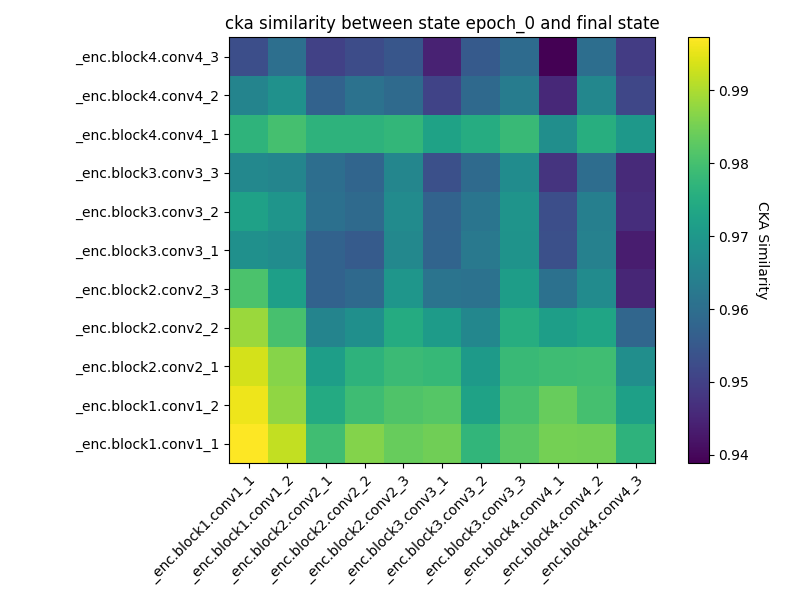<br><sub>Epoch 0</sub></td>
    <td align="center"><br><sub>Epoch 30</sub></td>
    <td align="center"><br><sub>Epoch 60</sub></td>
    <td align="center"><br><sub>Epoch 90</sub></td>
    <td align="center"><br><sub>Epoch 100</sub></td>
  </tr>
</table>
<p align="center"><em>ayerwise CKA similarity of a model trained with Adam-atan2 at each epoch versus at the end of training.</em></p>

The values on the diagonal of this matrix converge to unity because every layer of the model is exactly self-similar. It is also interesting to compare RSA similarities of layers of models trained with different optimizers:

<table align="center">
  <tr>
    <td align="center">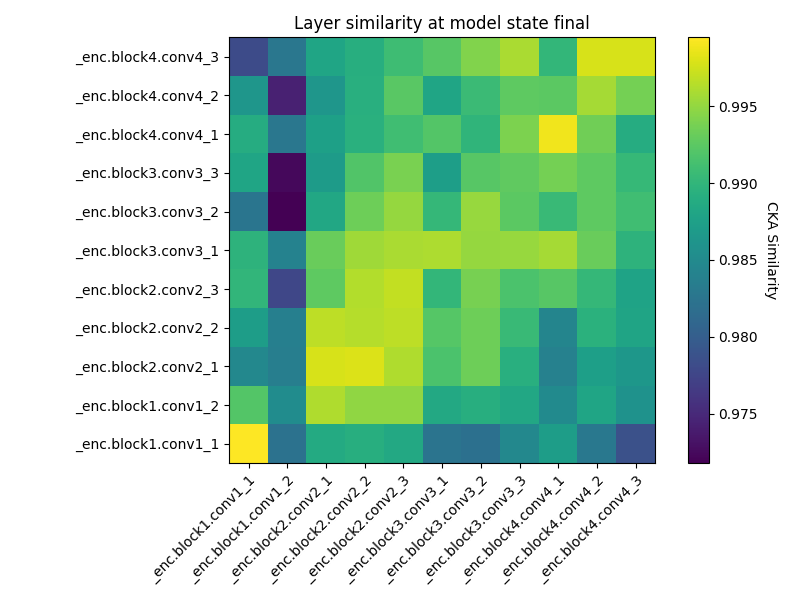<br><sub>(a) Adam-atan2 ($x$) vs. AdamW ($y$)</sub></td>
    <td align="center">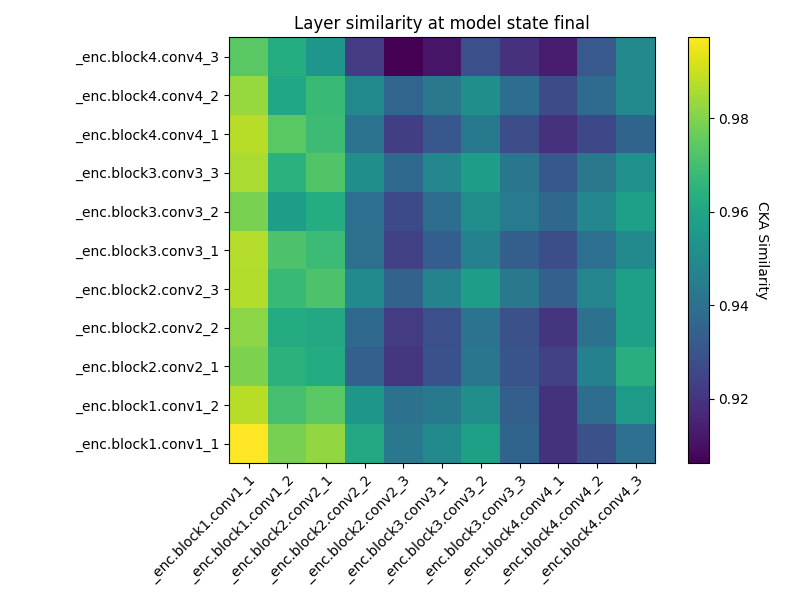<br><sub>(b) Adam-atan2 ($x$) vs. SGD ($y$)</sub></td>
    <td align="center"><br><sub>(c) AdamW ($x$) vs. SGD ($y$)</sub></td>
  </tr>
</table>
<p align="center"><em>Layerwise CKA similarity between models trained using different optimizers.</em></p>

### 4.2 Optimizer Implicit Bias Guides Feature Learning

We plot the similarity between layers trained using different optimizers as a function of training epoch. To prevent the plot from being too cluttered, we only consider the last layer of each convolutional block: layer 2 (b1_out), layer 5 (b2_out), layer 8 (b3_out), and layer 11 (b4_out). First we present the figures for CKA similarity:

FIGURES: plot_1_cka_adamw_adam_atan2, plot_1_cka_sgd_adam_atan2, plot_1_cka_sgd_adamw

<table align="center">
  <tr>
    <td align="center">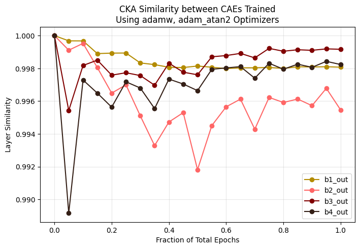<br><sub>(a) AdamW vs. Adam-atan2</sub></td>
    <td align="center">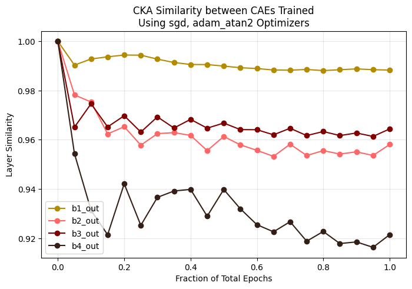<br><sub>(b) SGD vs. Adam-atan2</sub></td>
    <td align="center">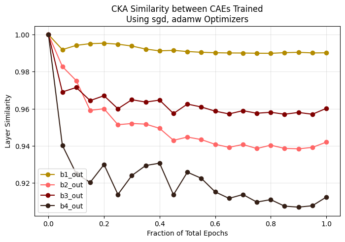<br><sub>(c) SGD vs. AdamW</sub></td>
  </tr>
</table>
<p align="center"><em>CKA similarity between layers of models trained with different optimizers as a function of training epoch.</em></p>

Comparing models trained with SGD versus adaptive algorithms, we see that their RSA scores diverge over the course of training, with deeper layers drifting further than shallower ones. By contrast, the RSA score between representations learned with AdamW and Adam-atan2 do not display a discernible pattern. We see a similar pattern when measuring similarity using PWCCA, though the plot shows much more variability in early stages of training:

FIGURES: plot_1_pwcca_adam_atan2_adamw, plot_1_pwcca_sgd_adam_atan2, plot_1_pwcca_sgd_adamw

<table align="center">
  <tr>
    <td align="center">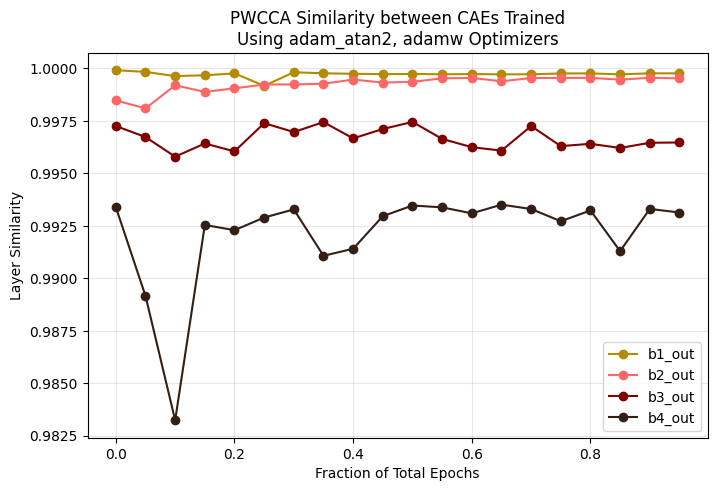<br><sub>(a) AdamW vs. Adam-atan2</sub></td>
    <td align="center">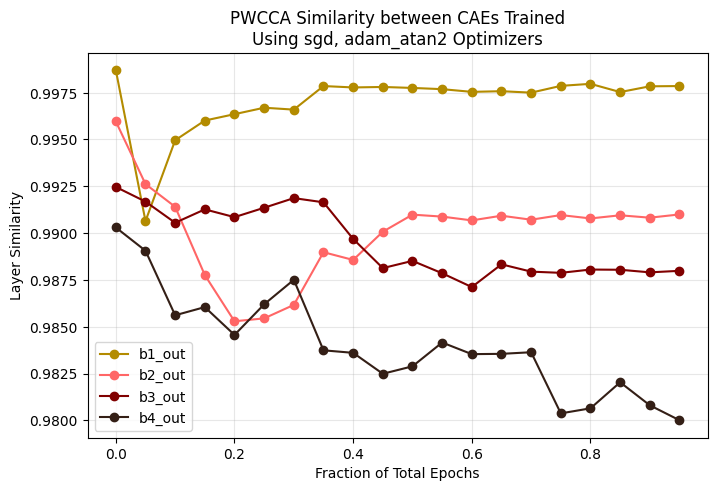<br><sub>(b) SGD vs. Adam-atan2</sub></td>
    <td align="center">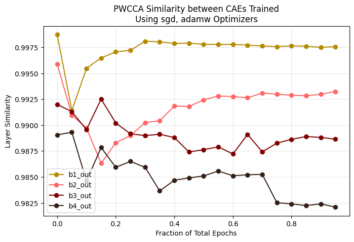<br><sub>(c) SGD vs. AdamW</sub></td>
  </tr>
</table>
<p align="center"><em>PWCCA similarity between layers of models trained with different optimizers as a function of training epoch.</em></p>

Deep vision models learn a hierarchy of features: neurons in shallow layers are associated with low-level features while neurons in deeper layers are associated with higher-level ones. Thus, there are two possibilities that we can think of which explain our results:

1. Models trained with SGD and Adam rely on similar low-level features but on more different high-level features for the task of image compression and reconstruction.

2. Low-level features tend to be learned roughly at the same depth, while higher-level features can develop at a larger range in depth. From the viewpoint of information theory, neural networks train at the so-called "[edge of chaos](https://proceedings.neurips.cc/paper/2004/hash/f8da71e562ff44a2bc7edf3578c593da-Abstract.html)," a regime where information content is not lost (drowned out by irreducible noise) or amplified (leading to exploding gradients). In this regime the model is roughly [scale-invariant](https://arxiv.org/abs/1611.01232): layers $`\ell`$, $`\ell+1`$ for $`\ell \gg1`$ are roughly equivalent in context. This means that the same feature can be learned at variable depth depending on the initialization and randomization of data-loading. For shallower layers however, the approximate scale invariance is [broken by finite-depth effects](https://deeplearningtheory.com/), putting pressure on features to be learned at fixed depths.

The former explanation suggests a difference in learned features based on optimizer, while the latter suggests a difference in depth at which features are learned. Given that feature learning is largely data-dependent, we are biased towards the latter interpretation.

### 4.3 Optimization Affects How Uniformly Representations Converge

We plot the RSA self-similarity scores of layers during training versus at their final state, for models trained with AdamW, Adam-atan2, and SGD.

FIGURE: plot_2_cka_sgd, plot_2_cka_adamw, plot_2_cka_adam_atan2

<table align="center">
  <tr>
    <td align="center">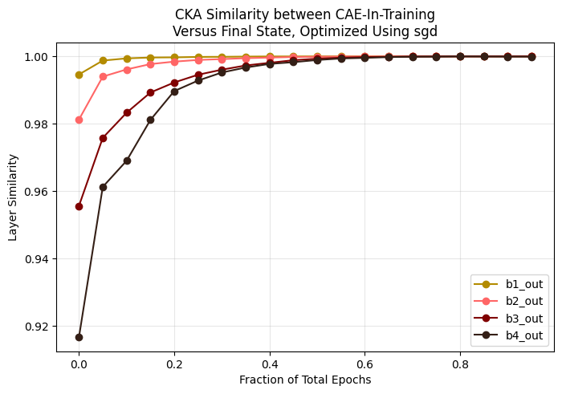<br><sub>(a) SGD</sub></td>
    <td align="center">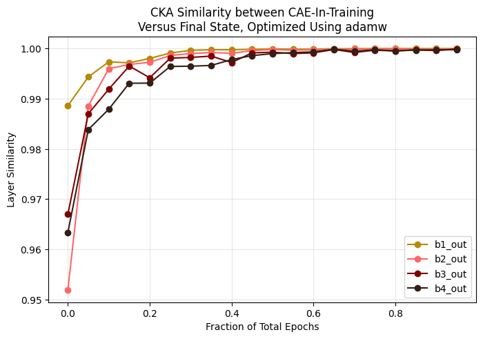<br><sub>(b) AdamW</sub></td>
    <td align="center">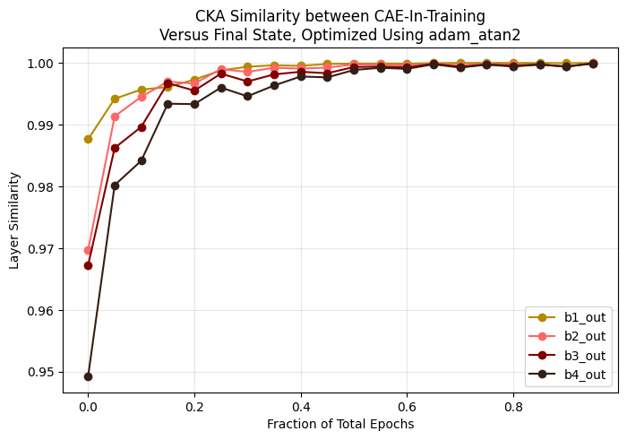<br><sub>(c) Adam-atan2</sub></td>
  </tr>
</table>
<p align="center"><em>CKA self-similarity of layers during training versus their final state.</em></p>

The results show a qualitative difference in the way layers converge to their final checkpoints depending on the optimizer used in training. Paying close attention to the difference in scale of the $`y`$-axis, we see that the main difference between SGD and adaptive momentum is that the deeper layers are learned much faster for Adam, at a rate comparable to shallow layers. By contrast, weights optimized with SGD appear to be learned "bottom-up" with shallower layers converging to their final features at the Adam rate while deeper ones do so only after shallow layers have stabilized. This means that Adam enjoys better sample efficiency when training on this task of image compression and reconstruction. Combined with the results of [Xie, Mohamadi, and Li (2025)](https://openreview.net/forum?id=PUnD86UEK5), this suggests that the loss landscape of the task at hand is characterized by $`\ell_\infty`$-smoothness, rather than $`\ell_2`$-smoothness.

Now consider the same figures, but with similarities calculated by PWCCA:

FIGURE: plot_2_pwcca_sgd, plot_2_pwcca_adamw, plot_2_pwcca_adam_atan2

<table align="center">
  <tr>
    <td align="center">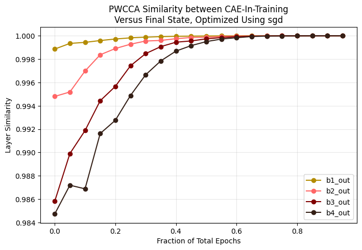<br><sub>(a) SGD</sub></td>
    <td align="center">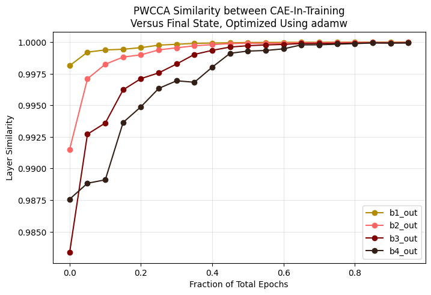<br><sub>(b) AdamW</sub></td>
    <td align="center">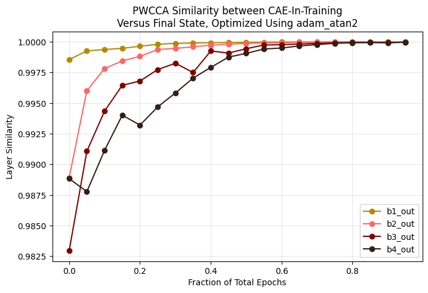<br><sub>(c) Adam-atan2</sub></td>
  </tr>
</table>
<p align="center"><em>PWCCA self-similarity of layers during training versus their final state.</em></p>

We see that the differences between SGD and adaptive methods disappear! So is the aforementioned phenomenon present or not? To answer this question, we performed a study to understand the sample efficiency of PWCCA and CKA. With fixed weights, we computed the PWCCA and CKA scores of AdamW versus SGD-optimized models using different number of samples $`m`$, i.e. so the activation vector takes the form $`[z_1^{(\ell)}, z_2^{(\ell)},\dots, z_m^{(\ell)}]`$. We then plotted the scores as a function of $`m`$:

FIGURE: probeset_resolution_adamw_sgd_cka, probeset_resolution_adamw_sgd_pwcca

<table align="center">
  <tr>
    <td align="center">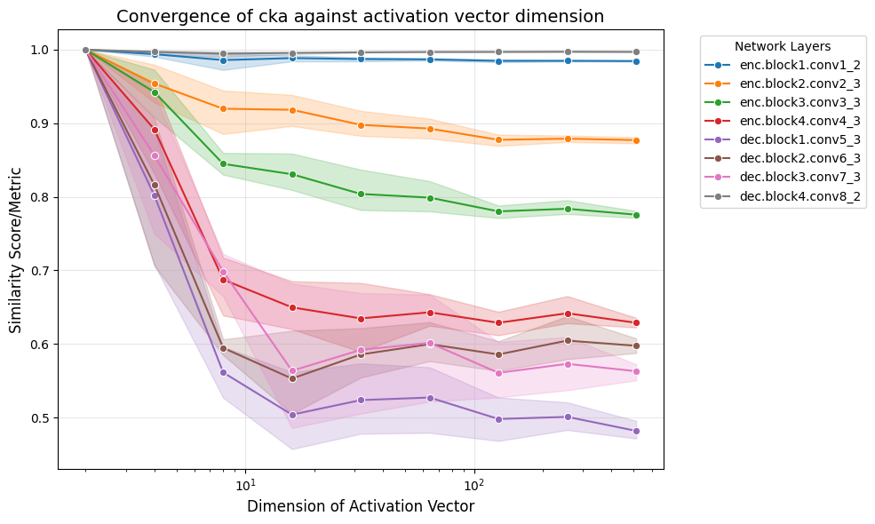<br><sub>(a) CKA</sub></td>
    <td align="center">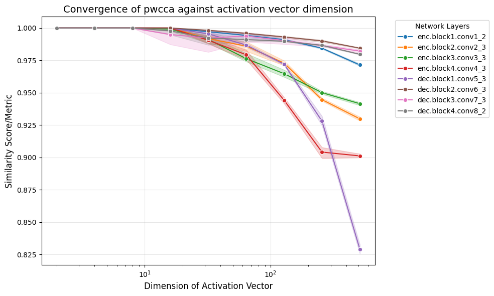<br><sub>(b) PWCCA</sub></td>
  </tr>
</table>
<p align="center"><em>RSA scores between AdamW- and SGD-trained models as a function of the number of samples $m$. Bands are 95\% CIs over three i.i.d.\ draws from the test set.</em></p>

The pre-activation for each layer was computed for three different i.i.d. draws from the test set and the RSA scores were averaged over the results; the bands represent 95% CIs for each line. For both similarity measures, the variance of RSA scores decreased as a function of samples used to compute pre-activations. However, while CKA scores began stabilizing to their asymptotic values around $`m = 16`$ samples, PWCCA scores continued to increase beyond $`m=512`$. More importantly, the rank-order of PWCCA similarity changes as a function of $`m`$, indicating that PWCCA is not a reliable measure of feature similarity in our use case. This gives credence to our initial observation that Adam does indeed have an advantage over SGD.

### 4.4 Optimization Affects the Final Location of Models in Representation Space

For each optimizer $`\in \{\text{SGD}, \text{AdamW}, \text{Adam-atan2}\}`$, we train ten models with different random initializations and data-loading order. We then compute the (banded mean diagonal) aggregate dissimilarity scores (see [above](#23-aggregate-model-to-model-metrics)) for every pair of models among the thirty models. We then optimized non-metric MDS and Isomap visualization algorithms with input the aggregate RSA-dissimilarity scores to obtain the following low-dimensional representations of model space.

FIGURE: plot_4_BDS_mds

<p align="center">
  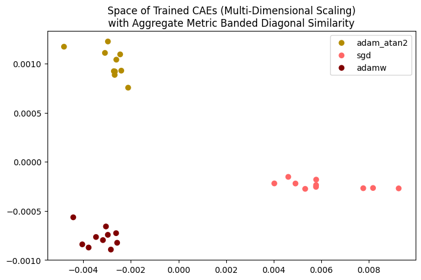
  <br>
  <em>Non-metric MDS embedding of the thirty trained models using banded diagonal dissimilarity.</em>
</p>

The $`n`$-dimensional coordinates $`(x_1,\dots, x_n)`$ of the embedding $`x`$ of a point are ordered by their variance/importance from greatest to least. Therefore, MDS visualization shows that models trained with SGD are very distinct from those trained with adaptive momentum: the separation in the $`x`$-axis implies that the variance in feature dissimilarity can be best explained by the different optimizers.

The next most important direction distinguishes the two adaptive optimizers. Note however the much smaller separation between the populations. This suggests that there is finer, second-order differences in their implicit biases which steer models to different regions in the loss landscape, beyond the (identical) KKT-characterization of AdamW and Adam-atan2.

This conclusion is supported by plotting the aggregate similarity between models as a function of training epoch. The CKA similarity scores between the adaptive algorithms hover at a much higher value throughout training as compared to when compared with SGD.

FIGURE: plot_3_BDS_cka_sgd_adamw

<p align="center">
  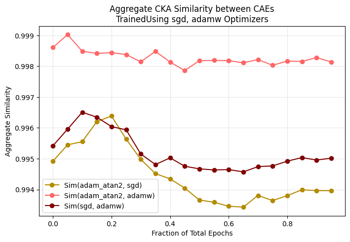
  <br>
  <em>Aggregate CKA similarity between models as a function of training epoch.</em>
</p>

The Isomap visualization shows a different characterization of the loss landscape. The models trained with adaptive optimizers are no longer well-separated, though the models trained with adaptive optimizers and SGD can still be distinguished by a simple elliptical boundary.

FIGURE: plot_4_BDS_isomap

<p align="center">
  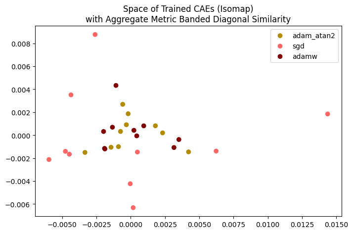
  <br>
  <em>Isomap embedding of the thirty trained models using banded diagonal dissimilarity.</em>
</p>

The previous visualizations used banded diagonal dissimilarity (BDD) as the non-metric score for MDS and Isomap. We found that when using Mean Diagonal Dissimilarity (MDD) there were outlier points far from the main cluster (note the scale on the axes). We attribute these outlier points as having learned features in a layer which is offset as compared to most of the other models.

FIGURE (MDS + Isomap, MDD)

<table align="center">
  <tr>
    <td align="center">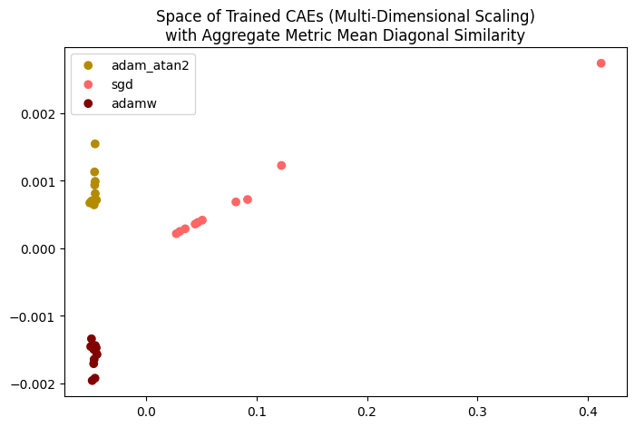<br><sub>(a) MDS</sub></td>
    <td align="center">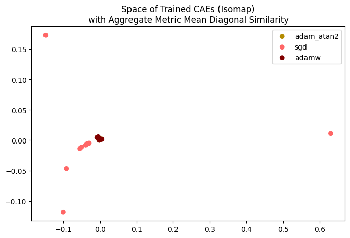<br><sub>(b) Isomap</sub></td>
  </tr>
</table>
<p align="center"><em>MDS and Isomap embeddings using mean diagonal dissimilarity (MDD).</em></p>

### 4.5 Limitations

In this section we discuss limitations of our study. The first is the disagreement between the results of CKA and PWCCA. As discussed earlier in section [4.3](#43-optimization-affects-how-uniformly-representations-converge), PWCCA becomes unreliable at low number of samples. This is largely due to its algorithm: when $`m < \max(d_1, d_2)`$ the matrix $`K`$ in the CCA algorithm is singular, with $`K`$ gaining more zero eigenvalues as $`m`$ decreases. This effectively cuts off the number of possible canonical directions and puts an upper bound on PWCCA score. To achieve a true empirical estimate of PWCCA similarity one must choose $`m`$ to be larger than $`d_1, d_2`$, but in this case the files containing activation data becomes prohibitively large (we use a moderate number $`m=128`$ of samples). For this reason it is common nowadays to use other RSA measures such as CKA or Orthogonal Procrustes which can be robustly estimated with much fewer samples.

In estimating CKA, we have used the biased (V-statistic) estimator which is computationally light but biased for small sample sizes. This is related to the fact that terms like $`\mathbb{E}k(X, X')`$ in $`\text{MMD}^2`$ requires independent draws $`X, X'`$ from the underlying distribution. The bias correction is of order $`m^{-2}`$ for $`m`$ samples and is negligible for our experiments.

Another limitation of our analysis is that we have not taken the finite mini-batch sizes into account. In hindsight, models should have been trained with full batch to get an accurate picture; mini-batches were used primarily for the goal of rich feature learning. Alternatively we could have investigated the implications of theoretical results in the mini-batch setting.

In our study we have also used an autoencoder with $`O(10^7)`$ parameters, much more than the 40,000 training samples of CIFAR-10. For classification tasks this would put us deep in the overfitting regime. Two competing forces work in our favor: (1) deep neural networks enjoy implicit regularization and they often happen to find good generalizing solutions despite being in this regime, (2) the trained task of image compression and reconstruction is much more difficult than a classification task: classifying CIFAR-10 involves picking one of 10 labels, while reconstructing a $`32\times 32`$ RGB image involves predicting 3072 distinct output dimensions. It would be interesting to understand where exactly this places our setup in the [double descent curve](https://iopscience.iop.org/article/10.1088/1742-5468/ac3a74/meta?casa_token=zOrNw_ctJWYAAAAA:IZWiEpri3kjZGWT5LQxN4Ilp9zRnAiEFWNtaTK5iZDjGe5_nDfSSW5W4FP3ZEUije7d-rGCNgAZ_7geKb8T4hZ9wqA).

Although PWCCA and CKA are commonly used in the RSA literature in both machine learning and computational neuroscience, they are not the only measures. A cross-disciplinary [study](https://dl.acm.org/doi/full/10.1145/3728458) conducted in 2023 concluded that no single measure outperformed others across all benchmarks. A good choice of similarity measure depends on the symmetries of data and underlying model, as well as practical considerations of bias-variance tradeoff: an expensive algorithm cannot make too many comparisons. A common algorithm omitted in this study is Orthogonal/Permutation Procrustes, which schematically optimizes $`\min_{g\in G} ||X - gY||_2`$ for $`G`$ and orthogonal or permutation group. Another interesting, but less explored direction is to consider the covariance matrices $`M = X^TX`$ of activation vectors $`X`$ within the space of PSD matrices. A natural measure of similarity is the [geodesic/earth mover's distance](https://www.sciencedirect.com/science/article/pii/S1053811921005474) on this space. Finally, neither PWCCA nor CKA satisfy the triangle inequality, a crucial property of metrics on normed vector spaces. A more correct approach, especially for Isomap visualization, would be to incorporate similarity measures [which do](https://proceedings.neurips.cc/paper_files/paper/2021/hash/252a3dbaeb32e7690242ad3b556e626b-Abstract.html).

## 5. Summary and Future Work

In this project we studied the effect of optimization on the training dynamics of deep neural networks trained on a real image dataset from the viewpoint of representational similarity analysis (RSA). We observe that optimizer implicit bias plays an important role in determining the final location of a trained model in the loss landscape, consistent with statistical learning theory. The novelty of our approach is using RSA analysis to arrive at this conclusion. To study this relationship, we first extended theoretical results on the implicit bias of optimizers to Adam-atan2 and batch GD with Nesterov momentum. We performed ablation studies by fixing the model architecture and dataset while varying initializations and data-loading orders across a fixed set of random seeds. Finally, we measured the similarity of trained models using the CKA and PWCCA scores.

It has been [recently observed](https://proceedings.iclr.cc/paper_files/paper/2026/hash/c3596a5990c2cddb0b0de478df7aca65-Abstract-Conference.html) that per-sample adaptive momentum optimizers, perhaps unexpectedly, have an implicit bias towards large $`\ell_{2}`$-margin separators on separable data instead of the expected $`\ell_{\infty}`$-margin for models in the full-batch setting. If this is true, then what we assumed about the implicit bias of AdamW and Adam-atan2 may not apply here. To be sure, one must study the phase transition of implicit bias as a function of batch size. It would be interesting to understand how small-batch Adam relates to SGD, which has implicit bias for hard $`\ell_{2}`$-margin separators in linear settings. It would also be interesting to extend our analysis to include other optimization algorithms such as [Muon](https://kellerjordan.github.io/posts/muon/), [Shampoo](https://scholar.google.com/scholar_lookup?arxiv_id=1802.09568), and [Lion](https://proceedings.iclr.cc/paper_files/paper/2024/hash/986e0caad271b59417287737416d8594-Abstract-Conference.html), all of which have [many](https://proceedings.neurips.cc/paper_files/paper/2025/hash/386432c7534eec9a1cd7cbeea90d7e9f-Abstract-Conference.html) [novel](https://arxiv.org/abs/2602.01105) [theoretical](https://arxiv.org/abs/2506.04192v2) [results](https://www.jmlr.org/papers/v27/25-0634.html) characterizing their implicit biases.

Finally, it is interesting to wonder how our results, and more generally the science of RSA and interpretability, helps explain the nature of generalization in large language model pretraining and fine-tuning. The success of multi-modal models suggests a sort of [vision-language convergence](https://arxiv.org/abs/2405.07987), though this position is hotly debated. We point out just one potential application for "representation engineering." Just as RSA [enables](https://openaccess.thecvf.com/content_ICCV_2019/html/Tung_Similarity-Preserving_Knowledge_Distillation_ICCV_2019_paper.html) the distillation of high-capacity teachers into more compute-efficient students, applying similar representation-matching techniques could help steer models towards safer and more useful behavior.

Another arena which benefits from a better understanding of rich feature learning is robotics and reinforcement learning. Because data is expensive to scale and environments often yield sparse rewards, a training pipeline with an inductive bias towards robotic goals could be much more data-efficient. Establishing an $`\{\text{architecture}, \text{data}, \text{optimizer}\}`$-independent characterization of feature learning could also help improve multi-sensor feature fusion, an essential component for Vision, Language, and Action (VLA) models like [RT-2](https://arxiv.org/abs/2307.15818).

## 6. Repository Structure

```
├── configs/             # Config files for Hydra
├── data/                # Contains CIFAR-10 (created by scripts)
├── experiments/         # Contains models (created by scripts)
├── outputs/             # Plots, files containing similarity data
├── scripts/             # Python scripts
├── PROOFS.md            # Proofs of the theoretical results
├── src/                 
│   ├── payload/         
│   │   └── analysis/    # Scripts for analyzing activations
│   │   └── data/        # Scripts to setup and load data
│   │   └── models/      # Model classes
│   │   └── training/    # Trainer and optimizers
│   │   └── utils/       # Helper functions and utilities
```

## 7. Citation

If you make use of this code or analysis in any way, please consider citing this repository as follows:

> **Hu, T. W.** (2026). *On Visualizing the Geometry of Optimization*. Retrieved from https://github.com/tw-hu/nn_optimization_similarity
